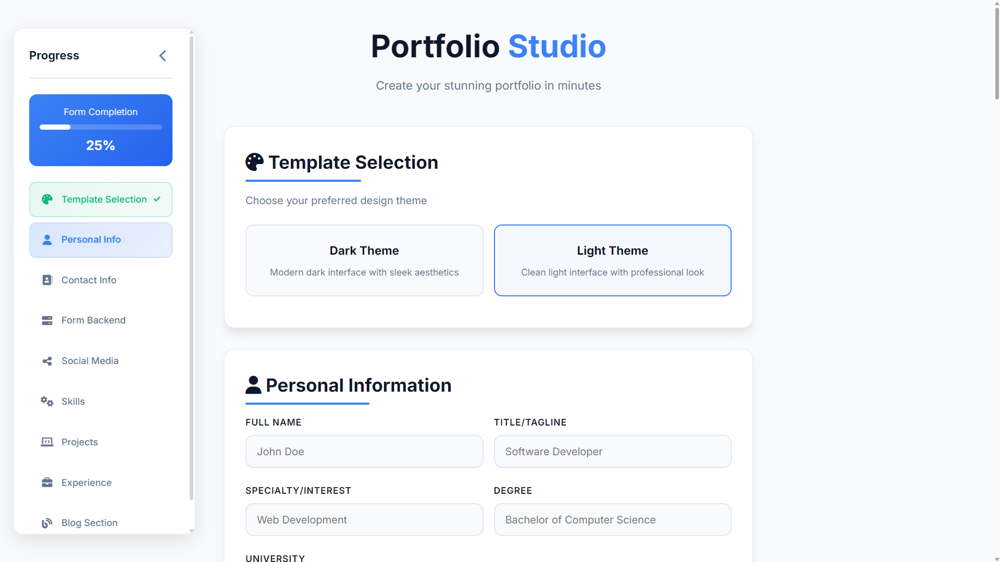
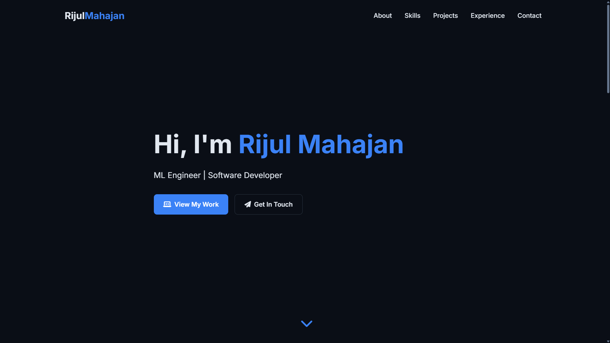

# 🪪 Portfolio Studio

**Portfolio Studio** is a sleek, dynamic, and customizable portfolio generator built entirely with HTML, CSS, and JavaScript. It lets users effortlessly create a modern, professional portfolio website through a visually rich form—**no coding required**.



---

## 🚀 Features

- 📋 Multi-section form for structured data entry

  - Personal Info
  - Contact Details
  - Education
  - Skills
  - Projects
  - Experience
  - Social Links
  - Blog Posts (Optional)

- 🎨 Theme selection (Light / Dark mode)
- 🖼️ Image upload with live preview
- 📎 Resume upload
- 🔧 Dynamic form sections (Add/Remove Projects, Skills, Blogs, Experience)
- 📊 Smart progress tracker and collapsible sidebar navigation
- 📦 One-click Portfolio Generation using in-memory data
- 💾 Session persistence (via `sessionStorage`)
- 🌐 Form backend integration (e.g., Formspree)

---

## 📁 File Structure

```
📁 PortfolioStudio/
├── index.html        # Main UI for form inputs
├── styles.css         # Custom modern styles with themes and animations
├── script.js          # Handles logic, validation, and dynamic rendering
└── README.md        # Project overview and usage instructions
```

---

## 📸 Demo

**Live Preview**: [Portfolio Studio](https://rijul-mahajan.github.io/Portfolio-Generator/)
<br></br>
**Output Example**: 

---

## ✅ Prerequisites

- A modern web browser (Chrome, Firefox, Edge)
- Internet connection for:

  - Font Awesome icons
  - JSZip (for optional download functionality)

---

## 💻 Run Locally

1. Clone the repository:

```bash
git clone https://github.com/rijul-mahajan/Portfolio-Generator.git
cd Portfolio-Generator
```

2. Open `form.html` in your browser:

```bash
open form.html      # Mac
start form.html     # Windows
xdg-open form.html  # Linux
```

3. Fill in the form and click **Generate Portfolio**.

---

## 🛠️ How It Works

- The form collects user data through various inputs.
- File/image uploads are read using `FileReader` and stored in memory.
- Portfolio data is serialized into a standalone HTML blob and opened in a new tab.
- The user can then save the generated site or host it anywhere.

---

## 🔍 Technologies Used

- **HTML5**
- **CSS3**
- **Vanilla JavaScript**
- **Font Awesome (for icons)**
- **JSZip** (for optional downloadable ZIP archive generation)

---

## 📦 Future Enhancements

- 💾 Cloud sync support (e.g., Firebase/IndexedDB)
- ✏️ More design templates
- 📤 Hosting & deployment (1-click Netlify/GitHub Pages)
- 📲 Responsive builder preview pane

---

## 🧑‍💻 Author

**Rijul Mahajan**

- GitHub: [@rijul-mahajan](https://github.com/rijul-mahajan)
- LinkedIn: [Rijul Mahajan](https://linkedin.com/in/rijul-mahajan05)

---

## 📄 License

MIT License. Feel free to fork, modify, and use!
